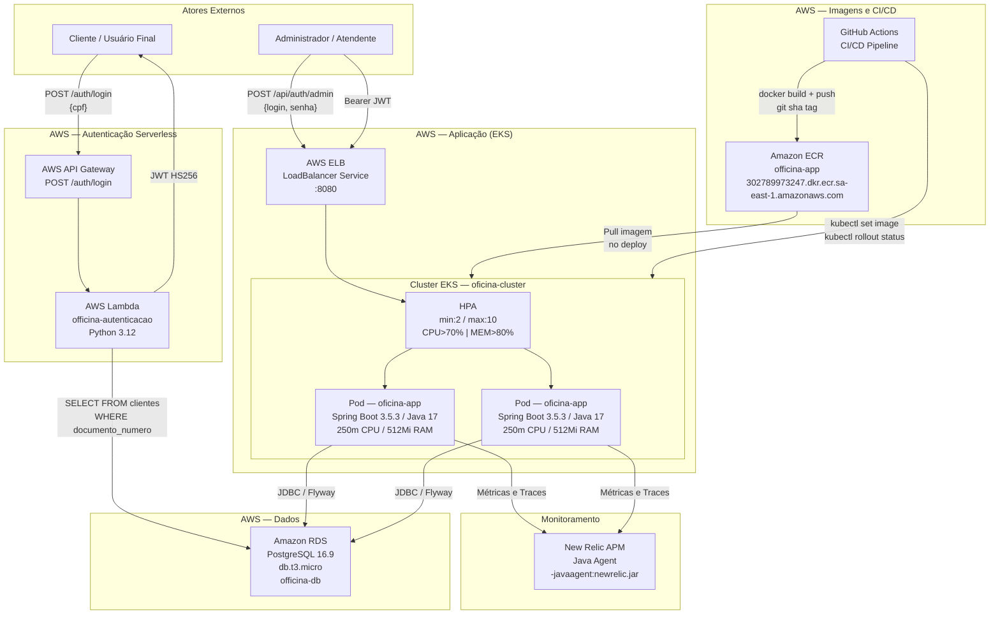
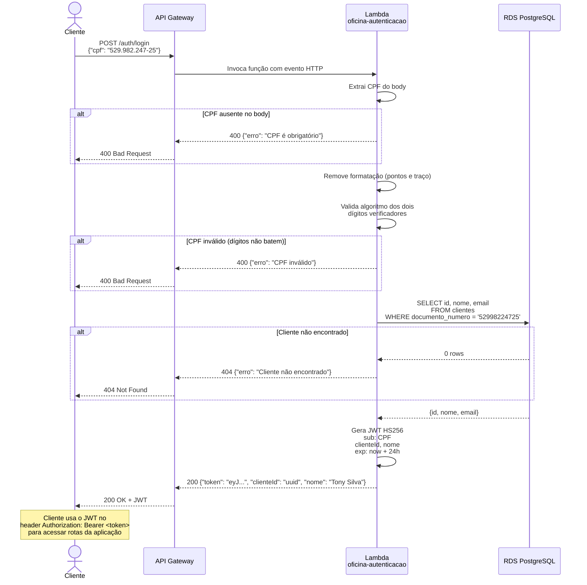
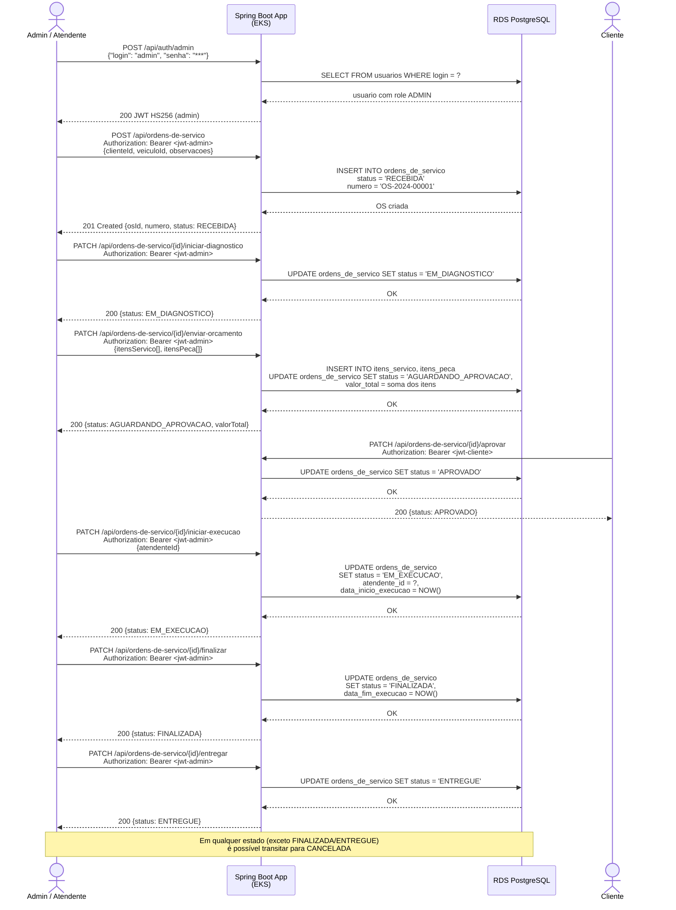
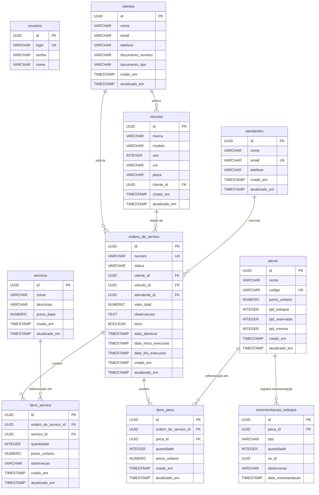

# Documentação de Arquitetura — Oficina Mecânica
## FIAP Pós-Tech Software Architecture — Fase 3

---

## Sumário

1. [Visão Geral do Sistema](#1-visão-geral-do-sistema)
2. [Diagrama de Componentes](#2-diagrama-de-componentes)
3. [Diagrama de Sequência — Autenticação via CPF (Lambda)](#3-diagrama-de-sequência--autenticação-via-cpf-lambda)
4. [Diagrama de Sequência — Abertura e Execução de OS](#4-diagrama-de-sequência--abertura-e-execução-de-os)
5. [Diagrama ER](#5-diagrama-er)
6. [Justificativa do Banco de Dados](#6-justificativa-do-banco-de-dados)
7. [RFCs](#7-rfcs)
8. [ADRs](#8-adrs)
9. [Modelo Relacional — Relacionamentos e Explicação](#9-modelo-relacional--relacionamentos-e-explicação)

---

## 1. Visão Geral do Sistema

O sistema de **Oficina Mecânica** é uma solução corporativa de gestão de ordens de serviço composta por **4 repositórios independentes**, todos implantados na AWS na região **sa-east-1 (São Paulo)**.

### Repositórios

| Repositório | Tecnologia | Responsabilidade |
|---|---|---|
| `oficina-lambda` | Python 3.12, AWS SAM | Autenticação de clientes por CPF via Lambda + API Gateway |
| `oficina-infra-db` | Terraform >= 1.5 | Provisionamento do RDS PostgreSQL 16.9 |
| `oficina-infra-k8s` | Terraform >= 1.5 | Provisionamento do cluster EKS Kubernetes 1.32 |
| `fiap-oficina` | Java 17, Spring Boot 3.5.3 | Aplicação principal com lógica de negócio |

### Infraestrutura AWS

| Recurso | Configuração | Endpoint / ARN |
|---|---|---|
| API Gateway (SAM) | REST API via AWS SAM | `https://fpwmtfk2k4.execute-api.sa-east-1.amazonaws.com/Prod/auth/login` |
| Lambda | `oficina-autenticacao`, Python 3.12, 256 MB, timeout 10s | Stack CloudFormation: `oficina-lambda-prod` |
| RDS PostgreSQL | PostgreSQL 16.9, `db.t3.micro`, 20 GB gp2 | `oficina-db.claqg4404q5p.sa-east-1.rds.amazonaws.com:5432` |
| EKS Cluster | Kubernetes 1.32, 1x `t3.micro` | `oficina-cluster` |
| ECR | Repositório de imagens Docker | `302789973247.dkr.ecr.sa-east-1.amazonaws.com/oficina-app` |
| S3 (Terraform State) | Backend remoto para ambos os infra repos | `oficina-terraform-state-302789973247` |
| S3 (SAM Artifacts) | Artefatos do AWS SAM | `oficina-sam-artifacts-302789973247` |

---

## 2. Diagrama de Componentes



### Descrição dos Componentes

- **Cliente**: usuário final que autentica via CPF pela Lambda. Após autenticado, usa o JWT recebido para acessar rotas públicas da aplicação.
- **Administrador/Atendente**: usuário administrativo que autentica via `POST /api/auth/admin` (login + senha) diretamente na aplicação Spring Boot.
- **API Gateway (SAM)**: ponto de entrada para autenticação de clientes. Gerenciado via AWS SAM, expõe `POST /auth/login`.
- **Lambda `oficina-autenticacao`**: valida o CPF pelo algoritmo dos dois dígitos verificadores, consulta o cliente no RDS e retorna um JWT HS256 com expiração de 24 horas.
- **ELB (LoadBalancer)**: exposto pelo Kubernetes Service do tipo `LoadBalancer`, encaminha requisições para os pods da aplicação.
- **EKS**: cluster Kubernetes 1.32 gerenciado pela AWS, com Node Group `t3.micro`. HPA escala de 2 a 10 réplicas baseado em CPU (>70%) e memória (>80%).
- **Spring Boot App**: aplicação Java 17 com Arquitetura Hexagonal (Ports and Adapters) e DDD. 5 bounded contexts: `atendimento`, `execucao`, `estoque`, `administracao`, `seguranca`.
- **RDS PostgreSQL**: banco relacional gerenciado pela AWS. Migrações gerenciadas pelo Flyway. Compartilhado entre Lambda e aplicação Spring Boot.
- **ECR**: registro de imagens Docker da AWS. A cada push em `homolog` ou `main`, o GitHub Actions constrói e envia a imagem com a tag do commit SHA.
- **New Relic APM**: monitoramento de performance da aplicação via Java agent (`-javaagent:/app/newrelic/newrelic.jar`) injetado na imagem Docker.

---

## 3. Diagrama de Sequência — Autenticação via CPF (Lambda)



---

## 4. Diagrama de Sequência — Abertura e Execução de OS



### Máquina de Estados da Ordem de Serviço

```
RECEBIDA → EM_DIAGNOSTICO → AGUARDANDO_APROVACAO → APROVADO → EM_EXECUCAO → FINALIZADA → ENTREGUE
    ↓              ↓                    ↓                ↓            ↓
CANCELADA      CANCELADA           CANCELADA        CANCELADA    CANCELADA
```

---

## 5. Diagrama ER



---

## 6. Justificativa do Banco de Dados

### PostgreSQL 16.9 no Amazon RDS

A escolha do **PostgreSQL** como banco de dados do sistema foi fundamentada nos seguintes critérios técnicos e operacionais:

#### Conformidade ACID

O sistema de ordens de serviço envolve transações financeiras (cálculo de `valor_total` a partir de itens de serviço e peças) e alterações de estado com múltiplas escritas simultâneas (inserção de itens + atualização do status da OS). A conformidade **ACID** (Atomicidade, Consistência, Isolamento e Durabilidade) do PostgreSQL garante que nenhuma dessas operações fique em estado inconsistente em caso de falha.

#### Suporte Nativo a UUIDs

Todas as entidades do sistema utilizam **UUID** como chave primária, eliminando colisões entre ambientes (desenvolvimento, homologação, produção) e facilitando a geração de identificadores no lado da aplicação sem dependência de sequências do banco.

#### Tipos Enumerados e Domínio Rico

O status da OS (`RECEBIDA`, `EM_DIAGNOSTICO`, `AGUARDANDO_APROVACAO`, `APROVADO`, `EM_EXECUCAO`, `FINALIZADA`, `ENTREGUE`, `CANCELADA`) e o tipo de movimentação de estoque (`ENTRADA`, `RESERVA`, `BAIXA`, `LIBERACAO_RESERVA`) são representados como strings controladas pela aplicação (via `VARCHAR` + validação no domínio), com toda a riqueza semântica do DDD preservada na camada de negócio.

#### Integridade Referencial

O modelo relacional do sistema é altamente normalizado, com múltiplas chaves estrangeiras (`cliente_id → clientes`, `veiculo_id → veiculos`, `servico_id → servicos`, `peca_id → pecas`, `atendente_id → atendentes`). O PostgreSQL impõe essas restrições nativamente via `REFERENCES`, prevenindo dados órfãos sem lógica adicional na aplicação.

#### Serviço Gerenciado (Amazon RDS)

O uso do **Amazon RDS** elimina a carga operacional de gerenciar o servidor de banco de dados: backups automáticos, patches de segurança, monitoramento de storage e failover são responsabilidade da AWS. Isso é especialmente relevante em um contexto acadêmico com equipe reduzida.

#### Elegibilidade ao Free Tier

A instância `db.t3.micro` com 20 GB de armazenamento `gp2` está dentro do **AWS Free Tier** (750 horas/mês), tornando o projeto economicamente viável para fins de demonstração e avaliação.

#### Performance do PostgreSQL 16

O PostgreSQL 16 trouxe melhorias significativas em paralelização de queries, eficiência do WAL (Write-Ahead Log) e desempenho de índices — relevantes para consultas frequentes como busca de OS por status e listagem de itens de uma OS, que são indexadas explicitamente nas migrações Flyway (`idx_ordens_status`, `idx_ordens_numero`, `idx_itens_servico_os_id`, `idx_itens_peca_os_id`).

---

## 7. RFCs

### RFC-001 — Escolha da AWS como Provedor de Nuvem

**Identificador:** RFC-001
**Status:** Aprovado
**Data:** 2026-08-01
**Autores:** itstoony - Grupo 231

---

#### Contexto

A Fase 3 do Tech Challenge exige a migração da aplicação para um provedor de nuvem com suporte a: orquestração de contêineres (Kubernetes gerenciado), banco de dados relacional gerenciado, funções serverless com API Gateway, registro de imagens Docker e pipeline CI/CD integrado.

Os três principais provedores avaliados foram **AWS**, **Azure** e **GCP**.

#### Decisão

Adotar a **Amazon Web Services (AWS)** como provedor de nuvem exclusivo para todos os serviços da Fase 3, utilizando a região `sa-east-1` (São Paulo).

Os serviços AWS utilizados são:
- **Amazon EKS** (Elastic Kubernetes Service) para orquestração dos contêineres
- **Amazon RDS** para banco de dados PostgreSQL gerenciado
- **AWS Lambda + API Gateway** (via AWS SAM) para autenticação serverless
- **Amazon ECR** (Elastic Container Registry) para armazenamento de imagens Docker
- **Amazon S3** para estado remoto do Terraform
- **GitHub Actions** integrado nativamente com AWS via `aws-actions`

#### Consequências

**Positivas:**
- Ecossistema unificado: EKS, RDS, Lambda, ECR e API Gateway são serviços nativos que se integram sem configuração extra de rede (VPC compartilhada, IAM Roles, Security Groups).
- AWS Free Tier cobre RDS `db.t3.micro`, Lambda (1M requests/mês) e API Gateway (1M requests/mês), reduzindo o custo do projeto a praticamente zero (exceto EKS).
- AWS SAM simplifica o deploy de Lambda + API Gateway com um único arquivo `template.yaml`, eliminando a necessidade de configuração manual no Console AWS.
- Ampla disponibilidade de documentação, tutoriais e suporte da comunidade.
- Ferramentas `aws-actions` para GitHub Actions são mantidas pela própria AWS, garantindo compatibilidade.

**Negativas:**
- O cluster EKS tem custo fixo de ~$0,10/hora (não tem Free Tier para o control plane). Para minimizar, o cluster pode ser destruído após a demonstração com `terraform destroy`.
- Lock-in com a AWS: a migração futura para outro provedor exigiria reescrever os manifestos Terraform e possivelmente adaptar o pipeline CI/CD.

---

### RFC-002 — Estratégia de Autenticação por CPF via Lambda

**Identificador:** RFC-002
**Status:** Aprovado
**Data:** 2026-08-05
**Autores:** itstoony - Grupo 231

---

#### Contexto

O sistema precisa suportar dois tipos de usuários com estratégias de autenticação distintas:

1. **Administradores e Atendentes**: já autenticados via `POST /api/auth/admin` com login e senha (Spring Security + BCrypt na aplicação Spring Boot).
2. **Clientes finais**: precisam de uma forma de autenticação que utilize o CPF como identificador natural do domínio brasileiro, sem necessidade de cadastrar uma senha.

O requisito da Fase 3 é implementar uma **Function Serverless** que realize essa autenticação de clientes.

#### Decisão

Implementar a autenticação de clientes como uma **AWS Lambda em Python 3.12**, exposta via **AWS API Gateway** (gerenciado pelo AWS SAM), com as seguintes responsabilidades isoladas:

1. Validar o CPF pelo **algoritmo dos dois dígitos verificadores** (sem dependência de serviços externos).
2. Consultar o cliente no **RDS PostgreSQL** pela coluna `documento_numero`.
3. Gerar e retornar um **JWT HS256** com `sub` (CPF), `clienteId`, `nome`, `iat` e `exp` (24 horas).

O **mesmo secret JWT** (`OFICINA_JWT_SECRET`) é compartilhado entre a Lambda e a aplicação Spring Boot, permitindo que o Spring Boot valide tokens gerados pela Lambda sem comunicação inter-serviços.

#### Consequências

**Positivas:**
- **Isolamento de responsabilidade**: a lógica de autenticação por CPF fica completamente separada da aplicação principal, podendo evoluir de forma independente (por exemplo, adicionar MFA ou OTP sem alterar o Spring Boot).
- **Escala independente**: a Lambda escala automaticamente conforme a demanda de logins, sem afetar os recursos do cluster EKS.
- **CPF como identificador natural**: o CPF é o documento de identificação padrão para pessoas físicas no Brasil, eliminando a necessidade de criar credenciais separadas para clientes.
- **Stateless**: o JWT HS256 permite que qualquer réplica do Spring Boot valide a autenticação sem consultar o banco ou manter sessão.
- **Custo zero**: dentro do Free Tier da AWS (1M requests/mês).

**Negativas:**
- **Acoplamento pelo secret JWT**: qualquer rotação do `JWT_SECRET` exige atualização simultânea nos secrets do `oficina-lambda` e do `fiap-oficina`, além de invalidar todos os tokens em circulação.
- **Latência de cold start**: a Lambda pode ter latência adicional (~200-500ms) no primeiro acesso após período de inatividade. Aceitável para autenticação (operação não-crítica de latência).
- **Acesso direto ao RDS**: a Lambda acessa o RDS diretamente via `psycopg2`, o que requer que o Security Group do RDS permita conexões do Lambda (ou configuração de VPC). Na implementação atual, o RDS está `publicly_accessible = true` para simplificação acadêmica.

---

### RFC-003 — Banco de Dados PostgreSQL Gerenciado (RDS)

**Identificador:** RFC-003
**Status:** Aprovado
**Data:** 2026-08-03
**Autores:** itstoony - Grupo 231

---

#### Contexto

A Fase 2 utilizava um contêiner PostgreSQL local rodando no cluster Kubernetes (Kind). Para a Fase 3, o requisito é migrar para um banco de dados **gerenciado em nuvem**, garantindo persistência, disponibilidade e eliminando a gestão manual do servidor de banco.

As opções avaliadas foram:
- **Amazon RDS for PostgreSQL** — serviço gerenciado nativo da AWS
- **Amazon Aurora PostgreSQL** — versão serverless da AWS, mais cara
- **Self-managed PostgreSQL em EC2** — maior controle, maior custo operacional

#### Decisão

Adotar o **Amazon RDS for PostgreSQL 16.9** com instância `db.t3.micro` e 20 GB de armazenamento `gp2`, provisionado via **Terraform** no repositório `oficina-infra-db`.

Configurações adotadas:
- `publicly_accessible = true` (para acesso da Lambda e desenvolvimento local — simplificação acadêmica)
- `skip_final_snapshot = true` (sem snapshot ao destruir — custo zero)
- `backup_retention_period = 0` (sem backups automáticos — custo zero)
- `deletion_protection = false` (facilita terraform destroy)
- Estado Terraform armazenado em S3 (`oficina-terraform-state-302789973247`)

#### Consequências

**Positivas:**
- **Zero gestão operacional**: patches, atualizações de OS, backups (quando habilitados), monitoramento de storage e rede são responsabilidade da AWS.
- **Endpoint estável**: o endpoint `oficina-db.claqg4404q5p.sa-east-1.rds.amazonaws.com` é fixo e pode ser configurado como secret no GitHub Actions e na aplicação sem risco de mudança.
- **Compartilhamento entre serviços**: tanto a Lambda (via `psycopg2`) quanto o Spring Boot (via JDBC + Flyway) acessam o mesmo banco, garantindo consistência dos dados.
- **Free Tier**: `db.t3.micro` com 20 GB é elegível ao Free Tier da AWS (750 horas/mês no primeiro ano), tornando o custo do RDS zero para fins acadêmicos.
- **PostgreSQL 16**: performance melhorada em queries paralelas e operações de escrita em alta concorrência.

**Negativas:**
- **`publicly_accessible = true`**: em produção real, o RDS não deveria ser acessível publicamente. A configuração correta seria colocar o RDS em subnet privada e acessá-lo somente via VPC. Esta é uma simplificação intencional do projeto acadêmico.
- **Sem Multi-AZ**: a instância `db.t3.micro` é single-AZ, sem failover automático. Em produção, seria necessário habilitar Multi-AZ para alta disponibilidade.

---

## 8. ADRs

### ADR-001 — Arquitetura Hexagonal (Ports and Adapters)

**Identificador:** ADR-001
**Status:** Aceito
**Data:** 2026-07-01 (herdado da Fase 2)
**Deciders:** Equipe Oficina Mecânica

---

#### Contexto

A aplicação possui um domínio complexo com múltiplos bounded contexts: `atendimento` (clientes e veículos), `execucao` (ordens de serviço e máquina de estados), `estoque` (peças e movimentações), `administracao` (serviços e configurações) e `seguranca` (autenticação e autorização). Cada contexto possui regras de negócio distintas e precisa ser testável de forma independente, sem acoplamento à infraestrutura (banco de dados, HTTP, e-mail).

A Fase 3 exige que a aplicação seja implantada em Kubernetes na AWS (EKS), com banco gerenciado (RDS), monitoramento (New Relic) e autenticação externa (Lambda). Qualquer mudança de infraestrutura não deve impactar as regras de negócio.

#### Decisão

Adotar a **Arquitetura Hexagonal (Ports and Adapters)** em todos os bounded contexts da aplicação, com a seguinte estrutura de pacotes para cada contexto:

```
<contexto>/
├── domain/          ← Entidades, Value Objects, regras de negócio puras (sem dependências externas)
├── application/     ← Use Cases (Ports de entrada), orquestração do domínio
└── adapter/         ← Implementações concretas (REST controllers, JPA repositories, e-mail, etc.)
```

Os **Ports** são interfaces Java definidas no pacote `application`, implementadas pelos **Adapters** no pacote `adapter`. O domínio não conhece a existência de Spring, JPA, Jackson ou qualquer framework.

#### Consequências

**Positivas:**
- **Testabilidade**: o domínio e os use cases podem ser testados com JUnit 5 + Mockito sem inicializar o contexto Spring, garantindo testes rápidos e isolados.
- **Substituição de adapters**: trocar o banco de dados (de PostgreSQL para outro), o framework HTTP (de Spring MVC para Quarkus) ou o serviço de e-mail não exige mudanças no domínio.
- **Clareza arquitetural**: a separação em `domain`, `application` e `adapter` torna explícito onde cada tipo de código deve residir, facilitando a revisão de código e onboarding de novos membros.
- **Alinhamento com DDD**: cada bounded context é um módulo coeso, com linguagem ubíqua própria e sem vazamento de conceitos entre contextos.

**Negativas:**
- **Boilerplate**: a arquitetura exige mais arquivos (interfaces, DTOs de porta, implementações de adapter) em comparação com uma abordagem Controller → Service → Repository direta.
- **Curva de aprendizado**: desenvolvedores habituados com Spring MVC convencional precisam compreender o fluxo Adapter → Port → Domain → Port → Adapter para implementar funcionalidades.

---

### ADR-002 — Estratégia Recreate no Kubernetes

**Identificador:** ADR-002
**Status:** Aceito
**Data:** 2026-08-10
**Deciders:** Equipe Oficina Mecânica

---

#### Contexto

O cluster EKS utiliza um único nó `t3.micro` com recursos limitados: aproximadamente **1 vCPU** e **1 GB de RAM**. Cada pod da aplicação requisita `250m CPU` e `512Mi` de memória, com limite de `500m CPU` e `1Gi`.

A estratégia padrão do Kubernetes é `RollingUpdate`, que mantém a versão antiga rodando enquanto sobe a nova — efetivamente dobrando o consumo de recursos durante o deploy. Com um nó `t3.micro`, não há capacidade disponível para rodar 2 versões simultaneamente com as configurações de recursos definidas.

#### Decisão

Utilizar a estratégia **`Recreate`** no Deployment da aplicação. Esta estratégia encerra todos os pods da versão antiga antes de iniciar os pods da nova versão, evitando a necessidade de capacidade dupla durante o deploy.

**Configuração relevante no `app-deployment.yaml`:**
```yaml
spec:
  strategy:
    type: Recreate
```

O HPA (Horizontal Pod Autoscaler) está configurado com `minReplicas: 2` e `maxReplicas: 10`, escalando com base em CPU (>70%) e memória (>80%).

#### Consequências

**Positivas:**
- **Viabilidade operacional**: o deploy funciona corretamente dentro das restrições de hardware do nó `t3.micro`, sem erros de `Insufficient CPU/memory` durante o rollout.
- **Simplicidade**: sem necessidade de configurar `maxSurge` e `maxUnavailable` do `RollingUpdate`.

**Negativas:**
- **Downtime durante deploy**: há uma janela de indisponibilidade entre o encerramento dos pods antigos e a inicialização dos novos. O tempo de startup da aplicação Spring Boot (até 200 segundos com `startupProbe.failureThreshold: 20`) define a duração do downtime.
- **Aceitável para o contexto acadêmico**: o projeto é uma demonstração técnica. Em produção real, seria necessário um nó maior (ou múltiplos nós) para suportar `RollingUpdate` com zero downtime.

---

### ADR-003 — HPA com Mínimo de 2 Réplicas

**Identificador:** ADR-003
**Status:** Aceito
**Data:** 2026-08-10
**Deciders:** Equipe Oficina Mecânica

---

#### Contexto

O sistema precisa demonstrar capacidade de auto-escalonamento (HPA) como requisito da Fase 3. Ao mesmo tempo, o nó `t3.micro` tem capacidade limitada. É necessário equilibrar a demonstração do HPA com as restrições de infraestrutura.

O HPA monitora duas métricas: utilização de CPU (threshold: 70%) e utilização de memória (threshold: 80%), conforme configurado no `hpa.yaml`.

#### Decisão

Configurar o HPA com:
- **`minReplicas: 2`**: garante disponibilidade básica com duas réplicas em operação normal.
- **`maxReplicas: 10`**: permite escalar agressivamente em cenários de carga, demonstrando a capacidade de auto-escalonamento do EKS.
- **Métricas duplas**: CPU (`averageUtilization: 70`) e memória (`averageUtilization: 80`), permitindo escalonamento baseado tanto em processamento quanto em uso de heap da JVM.

#### Consequências

**Positivas:**
- **Demonstração efetiva do HPA**: o sistema escala automaticamente sob carga, demonstrando o requisito da Fase 3.
- **Resiliência básica**: com 2 réplicas mínimas, uma falha de pod não derruba o serviço completamente.
- **Custo controlado**: em repouso, apenas 2 pods estão ativos. O escalonamento só ocorre sob carga real.

**Negativas:**
- **Pressão constante no nó `t3.micro`**: 2 pods de `512Mi` cada = 1 GB de memória requisitada, o que corresponde a praticamente toda a RAM disponível no nó. Em cenários de alta carga, o escalonamento para além de 2 pods pode causar evictions por pressão de memória.
- **`maxReplicas: 10` é aspiracional**: com 1 nó `t3.micro`, nunca será possível atingir 10 réplicas sem adicionar mais nós ao Node Group. O limite real é ~2 pods por nó com as configurações atuais de recursos.

---

### ADR-004 — JWT Compartilhado entre Lambda e Spring Boot

**Identificador:** ADR-004
**Status:** Aceito
**Data:** 2026-08-05
**Deciders:** Equipe Oficina Mecânica

---

#### Contexto

O sistema possui dois geradores de JWT:
1. **Lambda `oficina-autenticacao`**: gera JWT para clientes autenticados por CPF.
2. **Spring Boot** (`/api/auth/admin`): gera JWT para administradores e atendentes autenticados por login/senha.

O Spring Boot precisa validar tokens gerados por ambos. O filtro JWT do Spring Security (`JwtAuthenticationFilter`) intercede em todas as requisições autenticadas, verificando a assinatura do token.

Opções avaliadas:
- **Chave assimétrica (RSA/EC)**: Lambda assina com chave privada, Spring Boot valida com chave pública. Mais seguro, mas requer gerenciamento de par de chaves.
- **Chave simétrica compartilhada (HS256)**: mesmo secret nos dois serviços. Mais simples, suficiente para o escopo do projeto.
- **Introspection endpoint**: Spring Boot consulta a Lambda para validar cada token. Alta latência, complexidade desnecessária.

#### Decisão

Utilizar **HS256 com secret compartilhado** (`OFICINA_JWT_SECRET`) entre a Lambda e o Spring Boot. O secret é injetado via variáveis de ambiente em ambos os serviços, gerenciado como **GitHub Secret** nos repositórios `oficina-lambda` e `fiap-oficina`.

- Na **Lambda**: `JWT_SECRET` via SAM Parameters → variável de ambiente.
- No **Spring Boot**: `OFICINA_JWT_SECRET` via Kubernetes Secret (`oficina-secrets`), injetado no pod.

O payload JWT inclui: `sub` (CPF ou login), `clienteId` (UUID do cliente, apenas para tokens Lambda), `nome`, `iat`, `exp` (24 horas).

#### Consequências

**Positivas:**
- **Simplicidade**: o Spring Boot já implementa validação HS256 com `jjwt`. Não requer nenhuma mudança na lógica de validação ao aceitar tokens da Lambda.
- **Zero latência adicional**: a validação é local (criptografia simétrica), sem chamadas de rede para verificar o token.
- **Suficiente para o escopo**: para um sistema acadêmico com equipe pequena, a gestão de par de chaves RSA adicionaria complexidade operacional sem benefício proporcional.

**Negativas:**
- **Acoplamento pelo secret**: qualquer rotação do `OFICINA_JWT_SECRET` invalida todos os tokens ativos e exige deploy simultâneo de ambos os serviços com o novo secret. Sem janela de tolerância (dois secrets válidos ao mesmo tempo).
- **Risco de vazamento**: se o secret for comprometido, qualquer pessoa pode gerar tokens válidos para qualquer CPF/usuário. Em produção real, a solução seria usar RSA (JWKS endpoint) ou AWS Cognito.
- **Sem distinção de issuer**: o Spring Boot não diferencia tokens emitidos pela Lambda dos emitidos por ele mesmo (exceto pela presença do campo `clienteId` no payload). Em cenários onde essa distinção for necessária, seria preciso adicionar o campo `iss` (issuer) e validá-lo.

---

## 9. Modelo Relacional — Relacionamentos e Explicação

### Visão Geral

O modelo relacional reflete diretamente os bounded contexts da Arquitetura Hexagonal e os agregados do DDD. Todos os identificadores são **UUID** (gerados pela aplicação), e todos os timestamps incluem `criado_em` e `atualizado_em` para auditoria.

### Relacionamentos Detalhados

#### `clientes` → `veiculos` (1:N)

Um cliente pode possuir múltiplos veículos. A chave estrangeira `veiculos.cliente_id` aponta para `clientes.id`. O índice `idx_veiculos_cliente_id` garante consultas eficientes ao listar os veículos de um cliente.

Regra de negócio: um veículo só pode estar associado a um único cliente. A transferência de propriedade do veículo não está no escopo atual do sistema.

#### `clientes` → `ordens_de_servico` (1:N)

Um cliente pode ter múltiplas ordens de serviço ao longo do tempo (para diferentes veículos ou repetidas manutenções). A coluna `ordens_de_servico.cliente_id` é obrigatória (`NOT NULL`), garantindo que toda OS tenha um cliente identificado.

#### `veiculos` → `ordens_de_servico` (1:N)

Um veículo pode ter múltiplas OS históricas. A coluna `ordens_de_servico.veiculo_id` é obrigatória, garantindo que toda OS esteja vinculada ao veículo que está sendo atendido.

#### `atendentes` → `ordens_de_servico` (0..1:N — nullable)

A coluna `ordens_de_servico.atendente_id` é **opcional** (`NULL` permitido). Um atendente só é designado para a OS no momento de `iniciar-execucao`. Antes disso (estados `RECEBIDA`, `EM_DIAGNOSTICO`, `AGUARDANDO_APROVACAO`, `APROVADO`), a OS não possui atendente responsável.

#### `ordens_de_servico` → `itens_servico` (1:N)

Cada OS pode conter múltiplos itens de serviço. Um item de serviço registra: qual serviço (`servico_id`), a quantidade executada, o preço unitário no momento da inclusão (snapshot de preço, independente de alterações futuras em `servicos.preco_base`) e uma observação opcional.

#### `ordens_de_servico` → `itens_peca` (1:N)

Similar aos itens de serviço, uma OS pode consumir múltiplas peças. Cada item de peça registra: qual peça (`peca_id`), a quantidade consumida e o preço unitário no momento do consumo (snapshot de preço).

#### `servicos` → `itens_servico` (1:N)

Um serviço (ex.: "Troca de óleo", "Alinhamento") pode aparecer em múltiplas OS ao longo do tempo. O `preco_unitario` em `itens_servico` é copiado de `servicos.preco_base` no momento da inclusão, preservando o histórico mesmo que o preço base do serviço seja alterado.

#### `pecas` → `itens_peca` (1:N)

Uma peça (ex.: "Filtro de óleo", "Pastilha de freio") pode ser utilizada em múltiplas OS. O `preco_unitario` em `itens_peca` é snapshot do preço no momento do consumo.

#### `pecas` → `movimentacoes_estoque` (1:N)

Toda alteração no estoque de uma peça gera um registro em `movimentacoes_estoque`. Os tipos de movimentação são:
- **`ENTRADA`**: compra ou reposição de estoque (aumenta `qtd_estoque`).
- **`RESERVA`**: peça reservada para uma OS aprovada (aumenta `qtd_reservada`, reduz disponível).
- **`BAIXA`**: consumo efetivo da peça quando a OS é executada (reduz `qtd_estoque` e `qtd_reservada`).
- **`LIBERACAO_RESERVA`**: OS cancelada após aprovação, liberando a reserva (reduz `qtd_reservada`, aumenta disponível).

### Campos Calculados

#### `ordens_de_servico.valor_total`

O campo `valor_total` (tipo `NUMERIC(10,2)`) representa o valor total da OS e é **computado pela aplicação** como a soma de:

```
valor_total = Σ(itens_servico.quantidade × itens_servico.preco_unitario)
            + Σ(itens_peca.quantidade × itens_peca.preco_unitario)
```

O valor é atualizado na coluna sempre que itens são adicionados ou removidos da OS (nos estados que permitem alteração). O campo existe para consultas eficientes (evitar joins e somas em cada leitura) e para exibição imediata sem recálculo.

#### `pecas.qtd_disponivel` (campo virtual)

A quantidade disponível de uma peça não é armazenada explicitamente no banco. É calculada como:

```
qtd_disponivel = qtd_estoque - qtd_reservada
```

Este cálculo é feito na camada de domínio (`Peca` entity) sempre que necessário. A separação entre `qtd_estoque` (total físico) e `qtd_reservada` (comprometido com OS aprovadas) garante que não se venda a mesma peça para dois clientes simultaneamente.

O campo `qtd_minima` define o ponto de reposição: quando `qtd_disponivel` cai abaixo de `qtd_minima`, o sistema deve alertar sobre necessidade de reposição de estoque.

### Índices de Performance

As migrações Flyway (V1) criaram os seguintes índices para otimizar as consultas mais frequentes:

| Índice | Tabela | Coluna | Justificativa |
|---|---|---|---|
| `idx_veiculos_cliente_id` | `veiculos` | `cliente_id` | Listar veículos de um cliente |
| `idx_ordens_cliente_id` | `ordens_de_servico` | `cliente_id` | Listar OS de um cliente |
| `idx_ordens_veiculo_id` | `ordens_de_servico` | `veiculo_id` | Listar OS de um veículo |
| `idx_ordens_status` | `ordens_de_servico` | `status` | Filtrar OS por status (painel operacional) |
| `idx_ordens_numero` | `ordens_de_servico` | `numero` | Busca por número da OS (ex.: "OS-2024-00001") |
| `idx_movimentacoes_peca_id` | `movimentacoes_estoque` | `peca_id` | Histórico de movimentações de uma peça |
| `idx_itens_servico_os_id` | `itens_servico` | `ordem_de_servico_id` | Itens de serviço de uma OS |
| `idx_itens_peca_os_id` | `itens_peca` | `ordem_de_servico_id` | Itens de peça de uma OS |

---

*Documento gerado em 2026-08-31 — FIAP Pós-Tech Software Architecture, Fase 3.*
